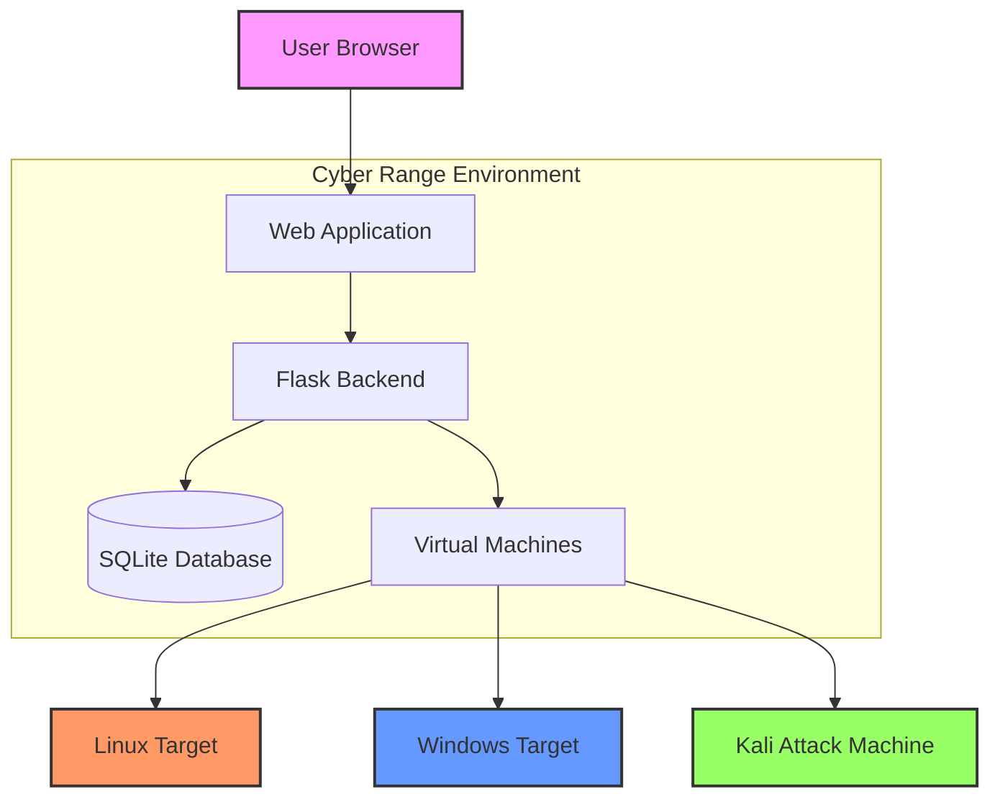

<div align="center">
  <h1>🔥 Cyber Range</h1>
  <h3>An Immersive Cybersecurity Training Platform</h3>
  
  [](https://www.python.org/)
  [](https://flask.palletsprojects.com/)
  [](https://opensource.org/licenses/MIT)
  [](https://github.com/SuhasKoparde/Cyberrange/stargazers)
  [](https://github.com/SuhasKoparde/Cyberrange/network/members)
  
  [](https://gitpod.io/#https://github.com/SuhasKoparde/Cyberrange)
  
  
  <a href="https://github.com/SuhasKoparde/Cyberrange/issues">
    
  </a>
</div>

## 🚀 Overview

Cyber Range is a comprehensive cybersecurity training platform designed to provide hands-on experience in a safe, controlled environment. This platform offers:

- **Realistic Attack Scenarios**: Practice on deliberately vulnerable systems
- **Guided Learning Paths**: Step-by-step challenges for all skill levels
- **Interactive Dashboard**: Track progress and monitor system metrics
- **Real-time Feedback**: Immediate results and guidance

## Features
- **Vulnerable VMs**: Pre-configured vulnerable machines for penetration testing
- **Network Isolation**: Segmented networks to prevent lateral movement
- **Attack Scenarios**: Guided challenges and CTF-style exercises
- **Monitoring Dashboard**: Real-time monitoring and logging
- **Web Interface**: User-friendly challenge management system
- **Interactive Learning**: Step-by-step guides and real-world scenarios

## 🏗️ Architecture



## 🛠️ Technology Stack

| Category        | Technologies                                                                 |
|----------------|------------------------------------------------------------------------------|
| **Frontend**   | HTML5, CSS3, JavaScript, Bootstrap 5, Chart.js                               |
| **Backend**    | Python 3.8+, Flask 2.0+, Flask-Login, SQLAlchemy                            |
| **Database**   | SQLite (Development), PostgreSQL (Production)                                |
| **Security**   | Flask-Security, bcrypt, JWT                                                 |
| **DevOps**     | Docker, Gunicorn, Nginx                                                     |
| **Monitoring** | Custom dashboard, System metrics, Application logging                       |

## 🚀 Features

### 🎯 Challenge System
- Multiple difficulty levels (Beginner to Advanced)
- Real-world attack scenarios
- Step-by-step walkthroughs
- Automated flag validation

### 📊 Dashboard
- Real-time system metrics
- Challenge progress tracking
- User statistics
- Achievement system

### 🔒 Security Features
- Isolated lab environments
- Rate limiting
- Input sanitization
- Secure session management

## 📦 Installation

### Prerequisites
- Python 3.8+
- pip (Python package manager)
- Virtual environment (recommended)

> **For Kali Linux users**: See the [Kali Linux Setup Guide](KALI_SETUP.md) for specific instructions.

### Setup Instructions

1. **Clone the repository**
   ```bash
   git clone https://github.com/SuhasKoparde/Cyberrange.git
   cd Cyberrange
   ```

2. **Create and activate virtual environment**
   ```bash
   # On Windows
   python -m venv venv
   .\venv\Scripts\activate
   
   # On macOS/Linux
   python3 -m venv venv
   source venv/bin/activate
   ```

3. **Install dependencies**
   ```bash
   pip install -r requirements.txt
   ```

4. **Initialize the database**
   ```bash
   python -c "from app import app, db; app.app_context().push(); db.create_all()"
   python -c "from app import init_db; init_db()"
   ```

5. **Run the application**
   ```bash
   python app.py
   ```

6. **Access the application**
   - Open your browser and go to: http://localhost:5000
   - Admin credentials: `admin` / `admin123`

## 📚 Documentation

For detailed documentation, please visit our [Wiki](https://github.com/SuhasKoparde/Cyberrange/wiki).

## 🤝 Contributing

Contributions are welcome! Please read our [Contributing Guidelines](CONTRIBUTING.md) for details on our code of conduct and the process for submitting pull requests.

1. Fork the repository
2. Create your feature branch (`git checkout -b feature/AmazingFeature`)
3. Commit your changes (`git commit -m 'Add some AmazingFeature'`)
4. Push to the branch (`git push origin feature/AmazingFeature`)
5. Open a Pull Request

## 📄 License

This project is licensed under the MIT License - see the [LICENSE](LICENSE) file for details.

## 🙏 Acknowledgments

- Hat tip to anyone whose code was used
- Inspiration
- References

## 📬 Contact

Suhas Koparde - [@YourTwitter](https://twitter.com/yourhandle) - your.email@example.com

Project Link: [https://github.com/SuhasKoparde/Cyberrange](https://github.com/SuhasKoparde/Cyberrange)

## Getting Started
1. Clone the repository:
   ```bash
   git clone https://github.com/SuhasKoparde/Cyberrange.git
   cd Cyberrange
   ```
2. Set up a virtual environment (recommended):
   ```bash
   python -m venv venv
   source venv/bin/activate  # On Windows: venv\Scripts\activate
   ```
3. Install dependencies:
   ```bash
   pip install -r requirements.txt
   ```
4. Initialize the database:
   ```bash
   python -c "from app import app, db; app.app_context().push(); db.create_all()"
   python -c "from app import init_db; init_db()"
   ```
5. Start the application:
   ```bash
   python app.py
   ```
6. Access the application at `http://localhost:5000`
   - Admin login: `admin` / `admin123`
   - User login: Create an account or use demo credentials

## Features in Detail

### Dashboard
- Real-time system metrics (CPU, Memory, Disk usage)
- Challenge progress tracking
- Virtual machine status monitoring

### Challenges
- Multiple difficulty levels
- Detailed descriptions and hints
- Step-by-step execution guides
- Real-world application scenarios

### Security Tools
- Integrated security tools
- Custom tools for vulnerability assessment
- Attack simulation capabilities

## Project Structure
```
CyberRange/
├── app/                    # Web application
├── vms/                    # VM configurations
├── network/                # Network topology files
├── challenges/             # Attack scenarios
├── monitoring/             # Logging and monitoring
├── docs/                   # Documentation
└── scripts/                # Automation scripts
```

## Academic Objectives
- Demonstrate understanding of cybersecurity principles
- Implement network security and isolation
- Create realistic attack scenarios
- Develop monitoring and incident response capabilities
- Build user-friendly interfaces for security training

## License
MIT License - Educational Use
=======
# Cyberrange
CyberRange is a hands-on cybersecurity training platform offering virtual labs, CTFs, and real-world attack/defense simulations. It helps students and professionals build skills in pentesting, forensics, incident response, and network/cloud security with guided learning paths and performance tracking.
>>>>>>> 77ab104934682258b59ebecdacbdecad664dcc34
