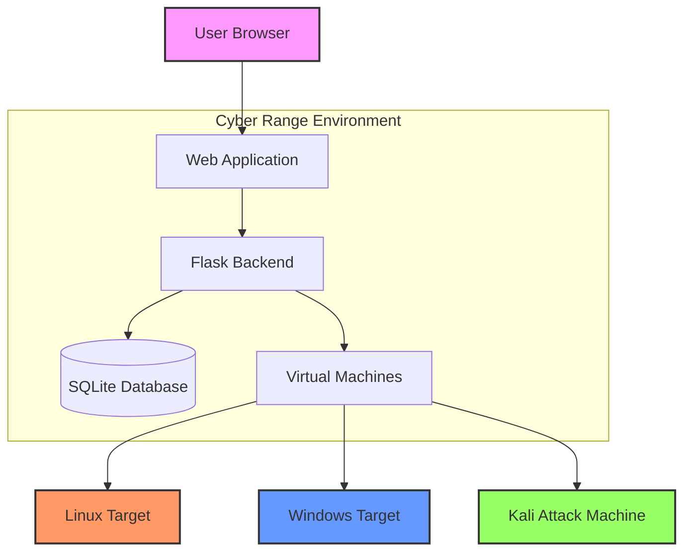

<div align="center">
  <h1>🔥 Cyber Range</h1>
  <h3>Kali Linux Cybersecurity Training Platform</h3>
  
  [](https://www.kali.org/)
  [](https://www.python.org/)
  [](https://flask.palletsprojects.com/)
  [](https://opensource.org/licenses/MIT)
  [](https://github.com/SuhasKoparde/Cyberrange/stargazers)
  
  
  
</div>

## 🚀 Overview

Cyber Range is a comprehensive cybersecurity training platform designed to provide hands-on experience in a safe, controlled environment. This platform offers:

- **Realistic Attack Scenarios**: Practice on deliberately vulnerable systems
- **Guided Learning Paths**: Step-by-step challenges for all skill levels
- **Interactive Dashboard**: Track progress and monitor system metrics
- **Real-time Feedback**: Immediate results and guidance

## Features
- **Vulnerable VMs**: Pre-configured vulnerable machines for penetration testing
- **Network Isolation**: Segmented networks to prevent lateral movement
- **Attack Scenarios**: Guided challenges and CTF-style exercises
- **Monitoring Dashboard**: Real-time monitoring and logging
- **Web Interface**: User-friendly challenge management system
- **Interactive Learning**: Step-by-step guides and real-world scenarios

## 🏗️ Architecture



## 🛠️ Technology Stack

| Category        | Technologies                                                                 |
|----------------|------------------------------------------------------------------------------|
| **Frontend**   | HTML5, CSS3, JavaScript, Bootstrap 5, Chart.js                               |
| **Backend**    | Python 3.8+, Flask 2.0+, Flask-Login, SQLAlchemy                            |
| **Database**   | SQLite (Development), PostgreSQL (Production)                                |
| **Security**   | Flask-Security, bcrypt, JWT                                                 |
| **DevOps**     | Docker, Gunicorn, Nginx                                                     |
| **Monitoring** | Custom dashboard, System metrics, Application logging                       |

## 🚀 Features

### 🎯 Challenge System
- Multiple difficulty levels (Beginner to Advanced)
- Real-world attack scenarios
- Step-by-step walkthroughs
- Automated flag validation

### 📊 Dashboard
- Real-time system metrics
- Challenge progress tracking
- User statistics
- Achievement system

### 🔒 Security Features
- Isolated lab environments
- Rate limiting
- Input sanitization
- Secure session management

## 🚀 Quick Start for Kali Linux

### Prerequisites
- Kali Linux 2023.3 or later
- Python 3.8+ (pre-installed on Kali)
- pip (Python package manager)
- Git (for initial setup)

### Installation

1. **Update your system**
   ```bash
   sudo apt update && sudo apt upgrade -y
   ```

2. **Install required system packages**
   ```bash
   sudo apt install -y python3-pip python3-venv git build-essential python3-dev libpq-dev libjpeg-dev zlib1g-dev
   ```

3. **Clone the repository**
   ```bash
   git clone https://github.com/SuhasKoparde/Cyberrange.git
   cd Cyberrange
   ```

4. **Set up virtual environment**
   ```bash
   python3 -m venv venv
   # On Windows:
   .\venv\Scripts\activate
   # On Linux/Mac:
   # source venv/bin/activate
   ```

5. **Upgrade pip and install Python dependencies**
   ```bash
   pip install --upgrade pip
   pip install -r requirements.txt
   ```

6. **Set up environment variables**
   ```bash
   cp .env.example .env
   # Edit the .env file with your configuration
   # nano .env
   ```

7. **Initialize the database**
   ```bash
   # For SQLite (default)
   python -c "from app import app, db; app.app_context().push(); db.create_all()"
   python -c "from app import init_db; init_db()"
   
   # For PostgreSQL (if configured in .env)
   # python -c "from app import app, db; app.app_context().push(); db.drop_all(); db.create_all()"
   # python -c "from app import init_db; init_db()"
   ```

8. **Start the development server**
   ```bash
   # For development
   python run.py
   
   # For production with Gunicorn (install with: pip install gunicorn)
   # gunicorn -w 4 -b 0.0.0.0:5000 app:app
   ```

### Running the Application

1. **Start the development server**
   ```bash
   python3 app.py
   ```

2. **Access the application**
   - Open your browser and go to: http://localhost:5000
   - Admin Panel: http://localhost:5000/admin
     - Username: `admin`
     - Password: `admin123`

### Offline Setup
For air-gapped environments, see the [Offline Installation Guide](KALI_SETUP.md#offline-setup) in the Kali Linux Setup documentation.

### Running as a Service
To run the application as a background service on Kali Linux:

1. Create a systemd service file:
   ```bash
   sudo nano /etc/systemd/system/cyberrange.service
   ```

2. Add the following configuration (adjust paths as needed):
   ```ini
   [Unit]
   Description=Cyber Range Application
   After=network.target

   [Service]
   User=$USER
   WorkingDirectory=/path/to/Cyberrange
   ExecStart=/path/to/Cyberrange/venv/bin/python3 app.py
   Restart=always

   [Install]
   WantedBy=multi-user.target
   ```

3. Enable and start the service:
   ```bash
   sudo systemctl daemon-reload
   sudo systemctl enable cyberrange
   sudo systemctl start cyberrange
   ```

For detailed information and troubleshooting, see the complete [Kali Linux Setup Guide](KALI_SETUP.md).

## 🛠️ Advanced Configuration

### Environment Variables

Create a `.env` file in the project root with the following variables:

```env
FLASK_APP=app.py
FLASK_ENV=development
SECRET_KEY=your-secret-key-here
DATABASE_URL=sqlite:///cyberrange.db
```

### Firewall Configuration

For optimal security, configure your firewall to restrict access:

```bash
# Allow HTTP traffic (if exposing to network)
sudo ufw allow 5000/tcp

# Or for production with Nginx
sudo ufw allow 'Nginx Full'
```

### Performance Tuning

For better performance in production:

1. **Use Gunicorn with Nginx**:
   ```bash
   pip install gunicorn
   gunicorn -w 4 -b 0.0.0.0:5000 app:app
   ```

2. **Configure Nginx as reverse proxy** (recommended for production)

## 📝 Documentation

### Kali Linux Documentation
- [Kali Linux Setup Guide](KALI_SETUP.md) - Complete setup and configuration
- [Offline Deployment](KALI_SETUP.md#offline-setup) - For air-gapped environments
- [Service Management](KALI_SETUP.md#running-as-a-service) - Running as a system service

### API Documentation
Access the interactive API documentation at `http://localhost:5000/api/docs` after starting the application.

## 🤝 Contributing

We welcome contributions from the community! Please follow these steps:

1. Read our [Code of Conduct](CODE_OF_CONDUCT.md)
2. Fork the repository
3. Create a feature branch (`git checkout -b feature/feature-name`)
4. Commit your changes (`git commit -m 'Add some feature'`)
5. Push to the branch (`git push origin feature/feature-name`)
6. Open a Pull Request

## 📄 License

This project is licensed under the MIT License - see the [LICENSE](LICENSE) file for details.

## 🙏 Acknowledgments

- Kali Linux Team for the amazing penetration testing platform
- Open-source community for valuable tools and libraries
- Security researchers who contribute to making the digital world safer

## 📬 Support

For support, please open an issue in the [GitHub repository](https://github.com/SuhasKoparde/Cyberrange/issues).

---

<div align="center">
  <p>Made with ❤️ for the InfoSec Community</p>
  <p>🔒 Keep Learning, Keep Hacking (Ethically!)</p>
</div>

## License
MIT License - Educational Use

## 🔰 Kali Linux Production Deployment

This section shows commands and helper files included in the `deploy/` folder to run the application on a Kali Linux machine using a Python virtual environment and Gunicorn (recommended for Linux).

### Deployment Files

Files in `deploy/` folder:
- `deploy/kali_deploy.sh` — Complete helper script that installs dependencies, creates venv, installs Python packages, and launches Gunicorn on port 8000.
- `deploy/cyberrange.service` — Example systemd unit for running as a background service.

### Quick Deployment Steps

1. **Clone the repository**
```bash
git clone https://github.com/SuhasKoparde/Cyberrange.git
cd Cyberrange
```

2. **Make deployment script executable and run it**
```bash
chmod +x deploy/kali_deploy.sh
sudo ./deploy/kali_deploy.sh
```

The script automatically:
- Installs system dependencies
- Creates Python virtual environment
- Installs Python packages from requirements.txt
- Starts Gunicorn server on port 8000

3. **Verify the application is running**
```bash
curl -I http://127.0.0.1:8000
# Expected: HTTP/1.1 200 OK

# Or access in browser
http://localhost:8000
```

4. **Login with default credentials**
- Username: `admin`
- Password: `admin123`

### Optional: Run as a System Service

To run the application automatically on boot:

1. **Copy the systemd service file**
```bash
sudo cp deploy/cyberrange.service /etc/systemd/system/cyberrange.service
```

2. **Edit the service file and set your paths**
```bash
sudo nano /etc/systemd/system/cyberrange.service
```

Make sure to update:
- `User=` → Your username
- `WorkingDirectory=` → Full path to `/home/your_user/Cyberrange`
- `ExecStart=` → Full path to Python in venv

3. **Enable and start the service**
```bash
sudo systemctl daemon-reload
sudo systemctl enable cyberrange
sudo systemctl start cyberrange
sudo systemctl status cyberrange
```

4. **Check logs**
```bash
sudo journalctl -u cyberrange -f
```

### Reverse Proxy with Nginx (Optional)

For better performance and TLS support:

1. **Install Nginx**
```bash
sudo apt install nginx -y
sudo systemctl enable nginx
```

2. **Create Nginx config**
```bash
sudo nano /etc/nginx/sites-available/cyberrange
```

Add:
```nginx
upstream cyberrange_app {
    server 127.0.0.1:8000;
}

server {
    listen 80;
    server_name _;

    location / {
        proxy_pass http://cyberrange_app;
        proxy_set_header Host $host;
        proxy_set_header X-Real-IP $remote_addr;
    }
}
```

3. **Enable the config**
```bash
sudo ln -s /etc/nginx/sites-available/cyberrange /etc/nginx/sites-enabled/
sudo nginx -t
sudo systemctl restart nginx
```

4. **Access via Nginx on port 80**
```bash
curl -I http://127.0.0.1
# Expected: HTTP/1.1 200 OK
```

### Important Notes

- All 6 challenges now include **4,700+ words of comprehensive guides** each
- Guides include **15+ step-by-step instructions** with copy-paste commands
- Each challenge has **real-world scenarios** and **prevention methods**
- Default port: **8000** (accessible at http://localhost:8000)
- Database: **SQLite** (auto-initialized on first run)
- For production, consider using **PostgreSQL** instead of SQLite

### Troubleshooting

**Application won't start:**
```bash
# Check if port 8000 is already in use
sudo lsof -i :8000
# Kill the process if needed
sudo kill -9 <PID>
```

**Check deployment script output:**
```bash
# Run with debug output
bash -x deploy/kali_deploy.sh
```

**View application logs:**
```bash
# If running as service
sudo journalctl -u cyberrange -n 50

# If running in terminal
# Press Ctrl+C to stop and see full output
```

### Next Steps

After deployment:
1. Access the web interface at `http://your_kali_ip:8000`
2. Login with `admin` / `admin123`
3. Click any challenge to see **complete step-by-step guides**
4. Each guide includes real commands you can copy and execute
5. Track your progress on the dashboard
