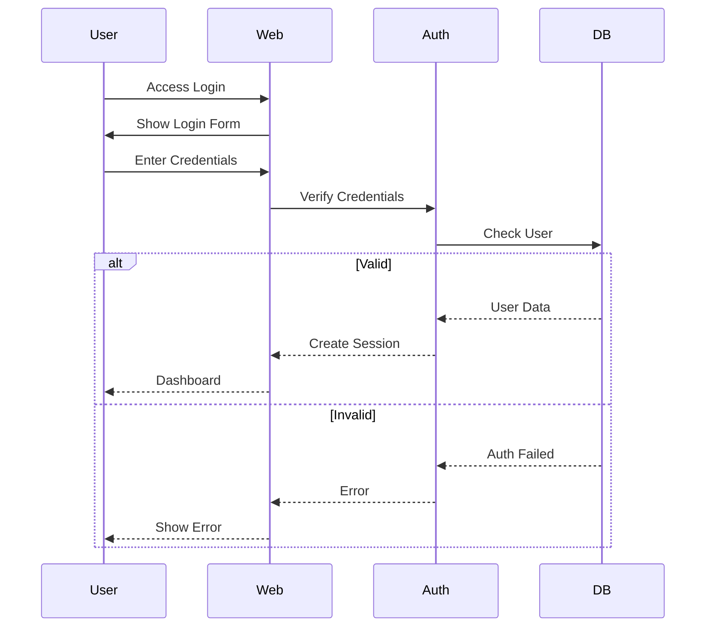

# CyberRange - System Design Document

## 4. System Design

### 4.1 Design Overview
The CyberRange is a sophisticated cybersecurity training platform with the following architectural components:

- **Frontend**: Modern web interface using HTML5, CSS3, and JavaScript
- **Backend**: Python Flask application
- **Virtualization**: VirtualBox/VMware integration
- **Database**: SQLite for data storage
- **Networking**: pfSense-based network isolation
- **Monitoring**: ELK Stack integration

### 4.2 Flowcharts

#### User Authentication


### 4.3 Network Architecture

#### Network Topology
```
┌───────────────────────────────────┐
│        Management Network         │
│  ┌─────────┐    ┌────────────┐   │
│  │  Web    │    │ Monitoring │   │
│  └────┬────┘    └────────────┘   │
└───────┼──────────────────────────┘
        │
┌───────▼──────────────────────────┐
│       Isolated Lab Network       │
│  ┌─────────┐    ┌────────────┐   │
│  │ Linux VM│    │ Windows VM │   │
│  └────┬────┘    └─────┬──────┘   │
│       │               │          │
└───────┴───────────────┴──────────┘
```

### 4.4 Database Schema

#### Users Table
```sql
CREATE TABLE users (
    id INTEGER PRIMARY KEY,
    username VARCHAR(80) UNIQUE NOT NULL,
    email VARCHAR(120) UNIQUE NOT NULL,
    password_hash VARCHAR(120) NOT NULL,
    role VARCHAR(20) DEFAULT 'student',
    created_at TIMESTAMP DEFAULT CURRENT_TIMESTAMP
);
```

### 4.5 Security Framework

#### Key Security Measures:
- **Authentication**: bcrypt password hashing
- **Authorization**: Role-based access control
- **Network**: TLS/SSL encryption
- **Data**: Encryption at rest
- **Monitoring**: Comprehensive logging

*Document generated on: 2025-03-27*
